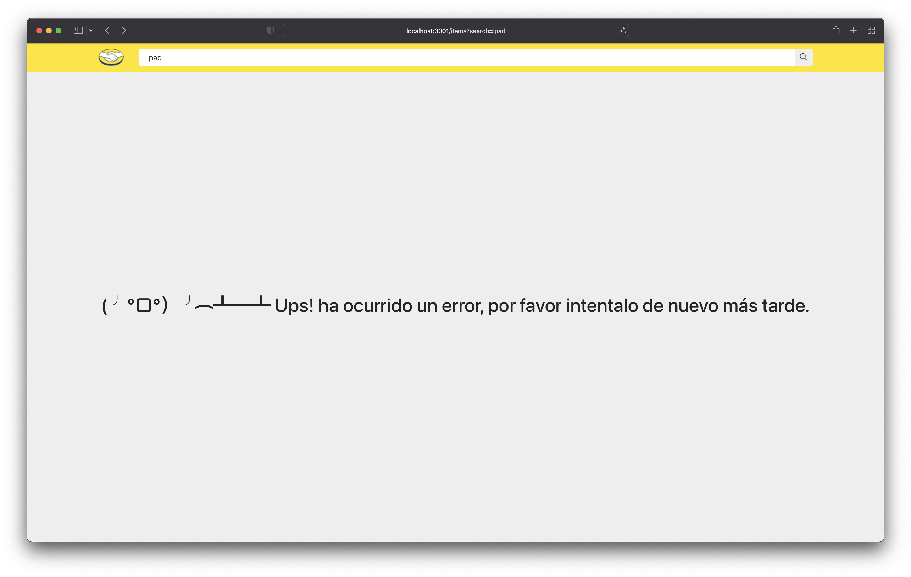

# MELI Challenge

## Instructions
To run the server:
  1. `cd server`
  2. `npm install`
  3. `npm run dev`

To run the client:
  1. `cd client`
  2. `npm install`
  3. `npm run dev`

## Features

### Demo

### Responsive design

### Loading state

### Error state

### Going directly to the URLs

## Client
The frontend was developed with React and TypeScript, using Vite as the
build tool for improved performance.

On the `/src` folder you can find three main subfolders: `/components`,
`/hooks`, and `views`.

* `/components` contains the basic components that are going to be used
  to build the views
* `/views` contains what one would call a whole 'feature', each view
  represents a route that is configured with react-router
* `/hooks` (could also be called 'controllers') custom, re-usable hooks
  that contain the logic used on the views, these are also responsible
  for making, and storing the requests to the backend

Additionally, on the `__tests__` folder there is a complete integration
test for the whole functionality including mocking the server requests
using `msw`. On the `/components` folder one could find the unit tests
for each specific component. 

Since the design specs relied heavily on the use of grids I decided to
use bootstrap for their built in components for 12-column grids, I
initially used css-grid however, when it came time to follow the spec
for nested grids it became way easier to develop and read using a tool like
bootstrap.

## Server
The backend was built using Express and Node. It was scaffolded using a
minimal express starter that I've used in the past:
https://github.com/w3cj/express-api-starter

The two endpoints available are:

* http://localhost:5000/api/items?search=${searchQuery}
* http://localhost:5000/api/items/${productId}

Example requests:

* http://localhost:5000/api/items?search=apple%20ipod
* http://localhost:5000/api/items/MLA935826998
